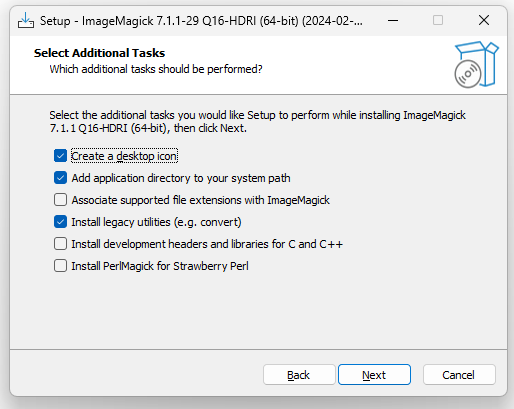

# YASGU : Youtube Automatised Shorts Generator And Uploader

<center></center>

YASGU is a tool to generate and upload Youtube Shorts videos. 
The main strength of YASGU is that it can generate videos fully automatically, from the script to the voiceover and the illustration images. 
Once the video is generated, it is uploaded to Youtube and published as a Youtube Shorts video.
Just specify your subject and language, and YASGU will take care of the rest.

Example of an automatically generated video in less than 5 minutes with YASGU : 


## Features 

- Fully automatic video generation and upload to Youtube.
- Uses GPT and other LLMs to generate the video script and CoquiTTS to generate the voiceover.
- Illustration images are generated using DALL-E, prodiamine, or other image generation models.
- Uploads the generated video to Youtube using Selenium and Firefox.
- Can generate videos in multiple languages.

## Prerequisites

- [Git](https://git-scm.com/downloads)
- [Python 3.9.X](https://www.python.org/downloads/) (Add to PATH) note: Python 3.10 is not supported due to
  dependencies.
- [ImageMagick](https://imagemagick.org/script/download.php) be sure to check "Install legacy utilities (e.g. convert)"
  during installation.
- [Microsoft Visual C++ Build Tools](https://visualstudio.microsoft.com/visual-cpp-build-tools/) for CoquiTTS. Install
  the "Desktop development with C++" workload.
- [Firefox](https://www.mozilla.org/en-US/firefox/new/) the browser used by Selenium.

## Installation

1. Clone the repository and install the requirements :

```bash
git clone https://github.com/hankerspace/YASGU.git

# Copy Example Configuration and fill out values in config.json
cp config/config.example.json config/config.json

# Create a virtual environment
python -m venv .venv

# Activate the virtual environment - Windows
.\.venv\Scripts\activate

# Activate the virtual environment - Unix
source .venv/bin/activate

# Install the requirements
pip install -r requirements.txt
```

2. Download the font used for the video script and place it in the `assets` folder. 
   You can download the font from [Google Fonts](https://fonts.google.com/) or Dafont for other fonts.
3. Download some free songs from [YouTube Audio Library](https://www.youtube.com/audiolibrary/music) and place them in the `assets` folder. 
   You can use the `youtube-dl` tool to download the songs from the Youtube Audio Library.

## Configuration

The configuration file is located at `config/config.json`. You can copy the example configuration file and fill out the values.

- verbose : Set to true to enable verbose logging.
- headless : Set to true to enable headless mode for the browser.
- threads : The number of threads to use for generating the video.
- assembly_ai_api_key : The API key for the AssemblyAI service. You can get an API key from the [AssemblyAI website](https://www.assemblyai.com/).
- imagemagick_path : The path to the ImageMagick installation binary (.exe for Windows, no extension for Unix).
- generators : The list of generators to run.

### Generators configuration

The `generators` section of the configuration file contains the list of generators to run. Each generator has its own configuration.

A generator is designed to create a specific kind of video, you can specify the following parameters for each generator:

- id : unique identifier for the generator.
- language : the language to use for the video.
- subject : the subject of the generated videos. You can choose a specific subject such as `History of France` or be more abstract like `Random facts about trees`.
- llm : The LLM model to use for generating the video script. You can find the available models in the [Available LLMs
  models](#available-llms-models) section.
- image_prompt_llm : The LLM model to use for generating the image prompt. You can find the available models in the
  [Available Image Generation models](#available-image-generation-models) section.
- image_model : The image generation model to use for generating the illustration images. You can find the available
  models in the [Available Image Generation models](#available-image-generation-models) section.
- images_count : The number of images to generate for the video.
- is_for_kids : Set to true if the video is for kids (in Youtube).
- font : The font filename to use for the video script. The fonts are located in `assets/fonts`.
- subtitles_max_chars : The maximum number of characters for the subtitles for a given line.
- subtitles_font_size : The font size for the subtitles.
- subtitles_font_color : The font color for the subtitles.
- subtitles_font_outline_color : The font outline color for the subtitles.
- subtitles_font_outline_thickness : The font outline thickness for the subtitles.
- audio_song_volume : The volume of the background song.
- firefox_profile : The path to the Firefox profile to use for the browser. You can create a new profile  and set the
  `firefox_profile` value to the path of the profile folder. Be sure to log in to your Youtube account and pick the Channel to upload to. More information on how to create a new profile can be found [here](https://support.mozilla.org/en-US/kb/profile-manager-create-and-remove-firefox-profiles).

### Available LLMs models

| Key                  | Model                      | Base Provider | Provider               | Website                                         |
|----------------------|----------------------------|---------------|------------------------|-------------------------------------------------|
| gpt35_turbo          | gpt-3.5-turbo              | OpenAI        | 5+ Providers           | [openai.com](https://openai.com/)               |
| gpt4                 | gpt-4                      | OpenAI        | 2+ Providers           | [openai.com](https://openai.com/)               |
| llama2_7b            | Llama-2-7b-chat-hf         | Meta          | 2+ Providers           | [llama.meta.com](https://llama.meta.com/)       |
| llama2_13b           | Llama-2-13b-chat-hf        | Meta          | 2+ Providers           | [llama.meta.com](https://llama.meta.com/)       |
| llama2_70b           | Llama-2-70b-chat-hf        | Meta          | 3+ Providers           | [llama.meta.com](https://llama.meta.com/)       |
| mixtral_8x7b         | Mixtral-8x7B-Instruct-v0.1 | Huggingface   | 4+ Providers           | [huggingface.co](https://huggingface.co/)       |
| dolphin_mixtral_8x7b | dolphin-2.6-mixtral-8x7b   | Huggingface   | g4f.Provider.DeepInfra | [huggingface.co](https://huggingface.co/)       |
| airoboros_70b        | airoboros-70b              | Huggingface   | g4f.Provider.DeepInfra | [huggingface.co](https://huggingface.co/)       |
| gemini               | gemini                     | Google        | g4f.Provider.Gemini    | [gemini.google.com](https://gemini.google.com/) |
| claude_v2            | claude-v2                  | Anthropic     | 1+ Providers           | [anthropic.com](https://www.anthropic.com/)     |
| claude_3_opus        | claude-3-opus              | Anthropic     | g4f.Provider.You       | [anthropic.com](https://www.anthropic.com/)     |
| claude_3_sonnet      | claude-3-sonnet            | Anthropic     | g4f.Provider.You       | [anthropic.com](https://www.anthropic.com/)     |

### Available Image Generation models

| Key     | Model         | Base Provider | Provider               | Website                                   |
|---------|---------------|---------------|------------------------|-------------------------------------------|
| v1      | DALLE v1      | OpenAI        | 5+ Providers           | [openai.com](https://openai.com/)         |
| v2      | DALLE v2      | OpenAI        | 2+ Providers           | [openai.com](https://openai.com/)         |
| v2-beta | DALLE v2-beta | OpenAI        | g4f.Provider.Bing      | [openai.com](https://openai.com/)         |
| v3      | DALLE v3      | OpenAI        | 2+ Providers           | [openai.com](https://openai.com/)         |
| lexica  | lexica        | Meta          | 3+ Providers           | [llama.meta.com](https://llama.meta.com/) |
| prodia  | prodia        | Meta          | 2+ Providers           | [llama.meta.com](https://llama.meta.com/) |
| simurg  | simurg        | Huggingface   | 4+ Providers           | [huggingface.co](https://huggingface.co/) |
| animefy | animefy       | Huggingface   | 4+ Providers           | [huggingface.co](https://huggingface.co/) |
| raava   | raava         | Huggingface   | g4f.Provider.DeepInfra | [huggingface.co](https://huggingface.co/) |
| shonin  | shonin        | Huggingface   | g4f.Provider.DeepInfra | [huggingface.co](https://huggingface.co/) |

## Acknowledgments

- [CoquiTTS](https://github.com/coqui-ai/TTS)
- [gpt4free](https://github.com/xtekky/gpt4free)
- [Herc.ai](https://discord.gg/luppux)

## Disclaimer

This project is for educational purposes only. The author will not be responsible for any misuse of the information
provided. All the information on this website is published in good faith and for general information purpose only. The
author does not make any warranties about the completeness, reliability, and accuracy of this information. Any action
you take upon the information you find on this website (FujiwaraChoki/MoneyPrinterV2), is strictly at your own risk. The
author will not be liable for any losses and/or damages in connection with the use of our website.